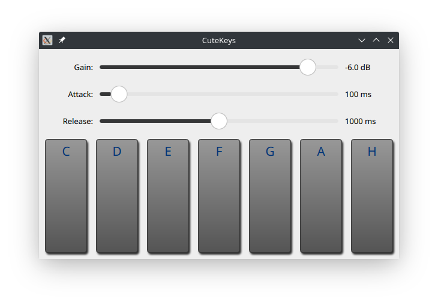

# CuteKeys

## Description

Small toyproject to learn some Qt and QML.

At the end this should be a syntesizer that can be played with its onscreen keyboard on convertibles and tablets (on Linux and maybe on Android).